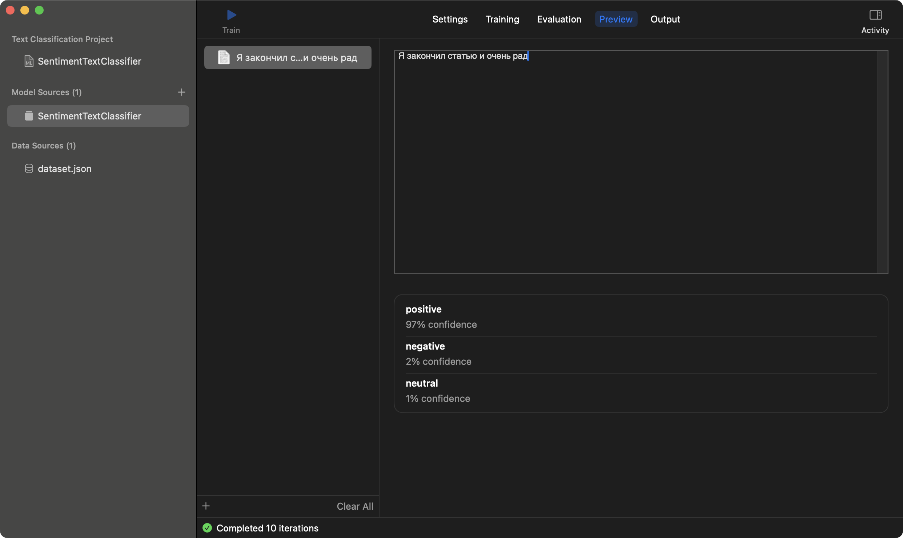

# CreateMLExample

An example project for [Creating ML models with Create ML](https://www.artemnovichkov.com/blog/create-ml) blog post.

  

## Author

Artem Novichkov, https://www.artemnovichkov.com/

## License

The project is available under the MIT license. See the [LICENSE](./LICENSE) file for more info.